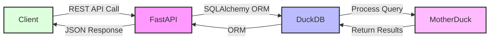

# DuckDB Data Proxy and Micro ORM

## Introduction

The DuckDB Data Proxy project simplifies working with DuckDB and MotherDuck through an easy-to-use RESTful interface. It's designed to make database interactions straightforward for your projects.

## Motivation/Why I Made This

- **Simplicity and Rapid Prototyping**: Offers a dynamic, RESTful interface to cater to various project requirements with minimal or no coding.
- **Adaptation to Serverless and Edge Computing**: Aims to provide a fitting database solution for applications operating at the internet's edge.
- **Leveraging DuckDB’s Speed**: While DuckDB excels in performance, integrating it directly into web applications posed challenges.
- **Filling the Gap Left by MotherDuck**: Although MotherDuck allows DuckDB to run serverlessly, it lacked a REST interface. This project aims to bridge that gap.
- **Inspiration from MongoDB's Atlas Data Proxy**: The convenience and developer-friendly nature of MongoDB's Atlas Data Proxy influenced the development of this project, promoting quick backend support for rapid prototyping.
- **Cost-Effective Deployment on Vercel**: The project prioritizes a deployment strategy that incurs minimal to no costs on platforms like Vercel.

## Design Goals

- **Adopting the ActiveRecord Pattern**: Mimics the ActiveRecord design pattern to offer an intuitive way of interacting with database records.
- **Automated CRUD Operations**: Streamlines Create, Read, Update, and Delete operations to save development time and effort.
- **Flexibility and Dynamic Nature**: Ensures the proxy can adapt to varying project needs without rigid constraints.
- **Single-File Implementation**: Strives for a lightweight solution, ideally encapsulated within a single file for ease of use and integration.


## Getting Started

### Python Environment Setup

1. **Create a Virtual Environment**: 
   ```bash
   python3 -m venv env
   ```
2. **Activate the Virtual Environment**: 
   ```bash
   source env/bin/activate
   ```
3. **Install Dependencies**: 
   ```bash
   pip install -r requirements.txt
   ```
### Environment Configuration

To configure the DuckDB Data Proxy for your projects, following environment variables are crucial. These variables should be defined in a `.env` file located at the root of your project. Here's how to configure them effectively:

Create a `.env` file at the root of your project and include the following lines:

```env
# .env file
DUCKDB_DATABASE_URL=
DUCKDB_SCHEMA_NAME=
```

- `DUCKDB_DATABASE_URL`: This variable specifies the connection URL to your DuckDB database, Motherduck instance, or an in-memory database.
- `DUCKDB_SCHEMA_NAME`: This variable defines the schema name for the operations conducted via the data proxy. If left blank, it defaults to considering all available schemas.

### Examples of `DUCKDB_DATABASE_URL` Configurations

Physical DuckDB file:

```env
DUCKDB_DATABASE_URL=duckdb:///path/to/your/database.duckdb
```
In-memory DuckDB instance:

```env
DUCKDB_DATABASE_URL=duckdb:///:memory:
```

Motherduck:

```env
DUCKDB_DATABASE_URL=duckdb:///md:[motherduck-token]@[db-name]
```
5. **Run the Project**:

   ```bash
   uvicorn main:app --reload
   ```

6. **Freeze Installed Packages** (for sharing or deployment): 
   ```bash
   pip freeze > requirements.txt
   ```

## RESTful Routes and Actions

Interact with your DuckDB database through the following RESTful routes by replacing `entity` with your table name:

| Method | Route             | Description                               | Query Parameter Examples                              |
|--------|-------------------|-------------------------------------------|-------------------------------------------------------|
| GET    | `/entity`         | List entities                             | `?limit=10&skip=20?select=field1..?order=field1 asc?field1.eq=value` |
| POST   | `/entity`         | Create a new entity                       | N/A                                                     |
| GET    | `/entity/:id`     | Get a single entity by ID                 | N/A                                                     |
| PUT    | `/entity/:id`     | Replace an entity by ID (full update)     | N/A                                                     |
| PATCH  | `/entity/:id`     | Update an entity by ID (partial update)   | N/A                                                     |
| DELETE | `/entity/:id`     | Delete an entity by ID                    | N/A                                                     |

### Query Parameter Examples

- **Filtering**: `?field1.eq=value` filters the list by `field1` equal to `value`.
- **Sorting**: `?order=field1 asc` sorts the list by `field1` in ascending order.
- **Pagination**: `?limit=10&skip=20` limits the list to 10 entities, skipping the first 20.
- **Selecting Fields**: `?select=field1,field2` selects only `field1` and `field2` to be returned in each entity in the list.

### Supported Filter Operators

The DuckDB Data Proxy supports a range of filter operators for querying data, allowing for precise data retrieval based on specific criteria:

- `.eq`: Equals
- `.neq`: Not equals
- `.gt`: Greater than
- `.gte`: Greater than or equal to
- `.lt`: Less than
- `.lte`: Less than or equal to
- `.like`: Like (for pattern matching)
- `.ilike`: Case-insensitive pattern matching

These operators can be used in query parameters to filter the data retrieved from the database. For example, `?name.like=%john%` would filter records where the `name` field contains "john".

## Additional Endpoints

In addition to the core RESTful routes, the DuckDB Data Proxy provides several utility endpoints for diagnostics, metadata, and system health checks:

| Method | Route                  | Description                                        | Query Parameter Examples |
|--------|------------------------|----------------------------------------------------|--------------------------|
| GET    | `/`                    | Root endpoint returning a welcome message.        | N/A                      |
| GET    | `/health`              | Health check endpoint.                             | N/A                      |
| GET    | `/debug/connection`    | Tests database connection.                         | N/A                      |
| GET    | `/metadata/tables`     | Lists all tables in the database.                 | N/A                      |

## Heads Up on Limitations

- **Performance Considerations**: Because of the way we jump from the edge to MotherDuck and back, and how we fetch data, especially when counting items for pagination, there might be a slight delay.
- **Primary Key Expectations**: Right now, we expect the primary key in your tables to be named "id". We know that’s not always the case, so we’re thinking of ways to work around this in future updates.

## Technology Stack

1. **FastAPI**:
2. **DuckDB and MotherDuck**:
3. **Python 3.9**:
4. **SQLAlchemy**:

## Architecture


## Deployment in Vercel

Deploying your application to Vercel can significantly simplify the process, thanks to its support for serverless functions. For a detailed guide on deploying FastAPI applications to Vercel, check out this insightful [blog post](https://dev.to/mihaiandrei97/building-a-fastapi-application-and-deploying-it-with-vercel-ho7). It walks you through the steps to ensure your application runs smoothly in a serverless environment, making your DuckDB Data Proxy accessible from anywhere.


## From Goduck to DuckDB Data Proxy

### Transitioning from Golang to Python
Before diving into this Python project, I launched [Goduck](https://github.com/senthilsweb/goduck), a similar initiative built with Golang. It aimed to provide REST API interaction with DuckDB and MotherDuck, much like what we're doing here but in the Go ecosystem.

### Shifting Gears to Python
While trying to deploy Goduck across various environments, including serverless platforms, I faced hurdles due to the C-go dependency of the Go duckDB driver, which made the build process tricky for different Linux systems. This challenge highlighted the benefits of Python's straightforwardness and the extensive support from its community. Here are the main insights:

- **Simpler Python Driver**: Python's approach to DuckDB felt more straightforward and developer-friendly.
- **Larger Python Community**: The vast Python community meant more potential users and contributors for this project.
- **Inspiration from MongoDB**: MongoDB's Atlas Data Proxy, which simplifies database operations, inspired me to offer a similar experience for DuckDB users, facilitating quick backend setups for rapid prototyping.

This journey from Goduck to developing a Python-based DuckDB Data Proxy emphasizes a shift towards accessibility, ease of use, and the desire to cater to a broader audience, fostering rapid development and deployment.


## Miscellaneous 

### Architecture Diagram - Mermaid code

